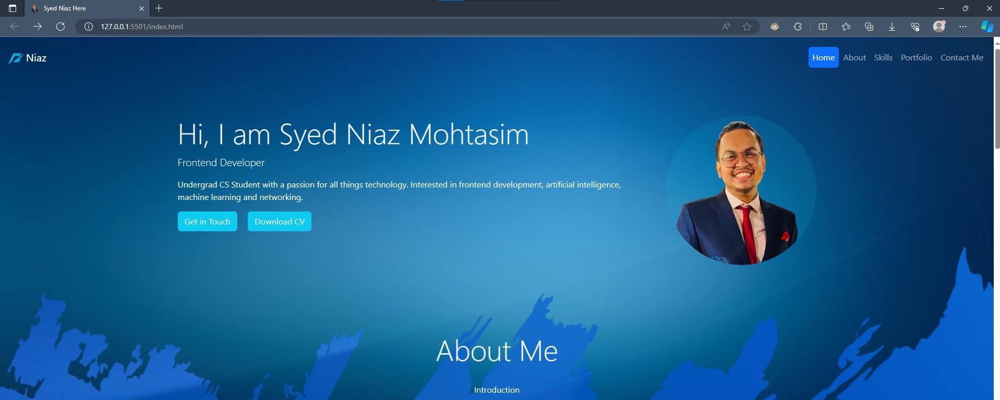
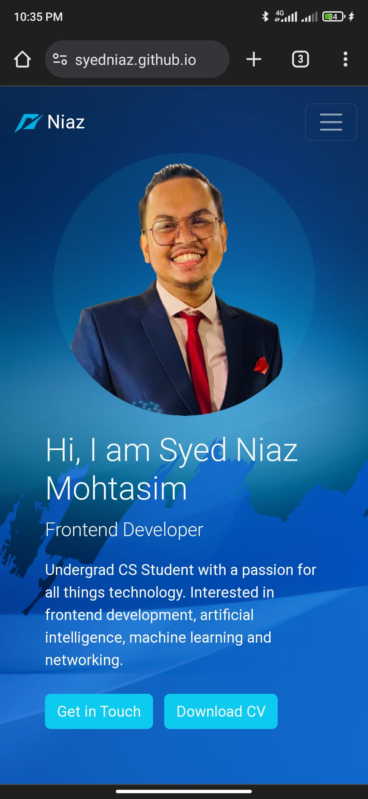

# syedniaz.github.io
# Portfolio

This portfolio project was build for my CSE309 Web Application course midterm project. This single page portfolio was build using HTML and CSS.
Levereged the most popular CSS framework Bootstrap 5 to make things easier and make the CSS file more cleaner.

## Screenshots
### Normal Screenshot

### Long Screenshot (Full Page)

### Screenshot (Mobile View)
